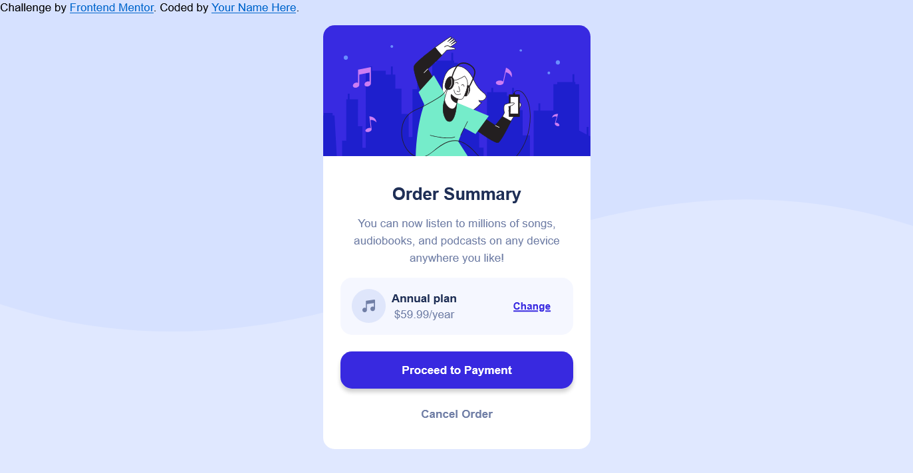

# Frontend Mentor - Order summary card solution

This is a solution to the [Order summary card challenge on Frontend Mentor](https://www.frontendmentor.io/challenges/order-summary-component-QlPmajDUj). Frontend Mentor challenges help you improve your coding skills by building realistic projects. 

- Solution URL: [solution URL](https://github.com/aurellia-bernice/Order-summary-card-solution)
- Live Site URL: [live site URL](https://aurellia-bernice.github.io/Order-summary-card-solution/)

## My process

### Built with

- Semantic HTML5 markup
- CSS custom properties
- Flexbox

### What I learned

